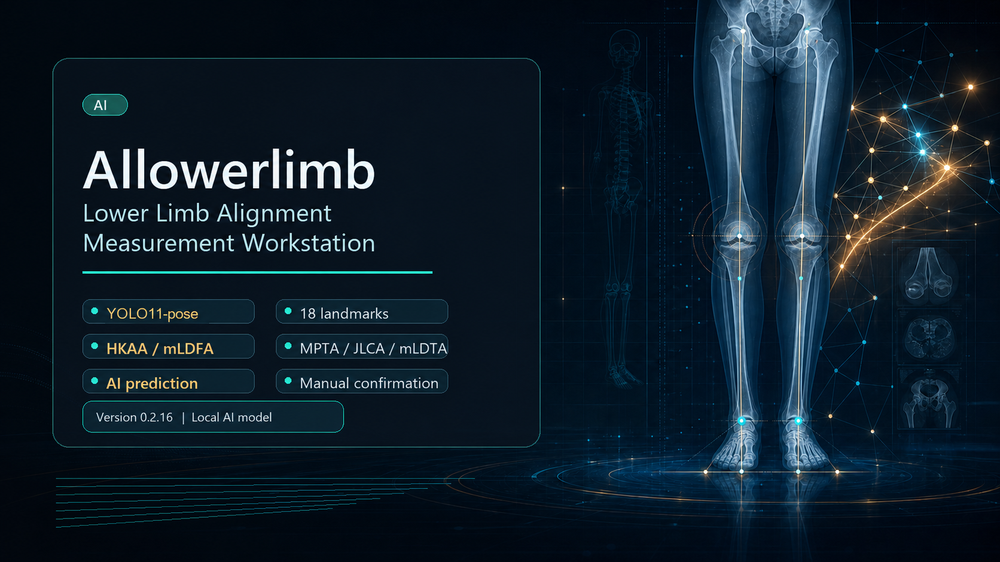
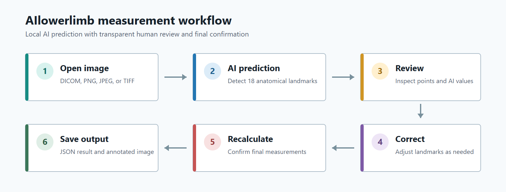

# AIlowerlimb

  

AIlowerlimb is a portable Windows application for AI-assisted lower-limb alignment measurement on standing full-length radiographs.

The workstation integrates local AI inference, anatomical landmark review, reader correction, measurement recalculation, and structured result export in a single graphical interface.

## Main Functions

- DICOM, PNG, JPG, JPEG, TIFF, and BMP image loading
- Local YOLO11-pose model inference
- Automatic prediction of 18 anatomical landmarks
- Bilateral HKAA, mLDFA, MPTA, JLCA, and mLDTA measurements
- Bilateral leg-length measurement when valid DICOM pixel spacing is available
- Separate AI and Final measurement results
- Manual landmark movement and correction
- Automatic recalculation after landmark correction
- Undo, zoom, pan, move, and fit-to-view tools
- JSON, CSV, XLSX, and annotated-PNG export

## Measurement Workflow

AIlowerlimb provides a reader-interactive workflow that combines local AI prediction with landmark review, manual correction, measurement recalculation, and final result export.

  

  <em>
    Image loading, AI landmark prediction, reader review, landmark correction,
    measurement recalculation, and structured result export.
  </em>

## Download

Download the compiled Windows application from the version-specific release page:

[Download AIlowerlimb v0.2.16 for Windows](../../releases/tag/v0.2.16)

## Quick Start

1. Download the Windows ZIP archive from the v0.2.16 Release page.
2. Extract the complete ZIP archive to a local folder.
3. Keep all extracted files and subfolders together.
4. Double-click `AIlowerlimb.exe`.
5. Open a supported image.
6. Select **Run AI** to perform local landmark prediction.
7. Review the 18 predicted anatomical landmarks and AI measurements.
8. Adjust landmarks when necessary.
9. Confirm the recalculated Final measurements.
10. Save the JSON, CSV, XLSX, and annotated-PNG outputs.

No conventional installation is required.

## System Requirements

- 64-bit Windows 10 or Windows 11
- x86-64 processor
- 8 GB RAM or more recommended
- At least 2 GB of available storage recommended
- 1920 × 1080 display recommended
- Local CPU-based inference
- No network connection required after downloading the software

## Documentation

The complete English user manual is included on the Release page.

## Data Privacy

AIlowerlimb performs inference locally and does not transmit patient images to a remote server.

The software does not automatically anonymize DICOM metadata, filenames, JSON files, or annotated images. Users must de-identify all files before public sharing.

## Availability

The compiled Windows application is publicly available for academic research and software evaluation.

The source code and model-training code are not included in this release. For access inquiries, please contact the author.

## Disclaimer

AIlowerlimb is intended for research and evaluation purposes only. It is not approved as a medical device and should not be used as the sole basis for clinical diagnosis, treatment planning, or patient-management decisions.

## Version Information

- Software: AIlowerlimb
- Version: 0.2.16
- Edition: HKAAClinical UltraLite CPU
- Primary executable: `AIlowerlimb.exe`
- Landmark model: YOLO11-pose with 18 ordered anatomical landmarks
